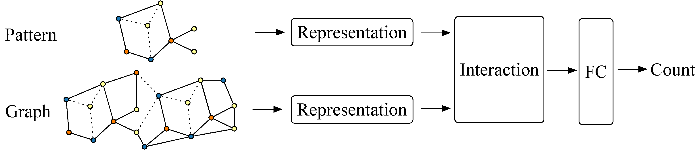
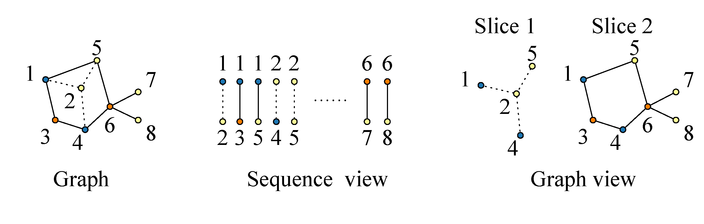
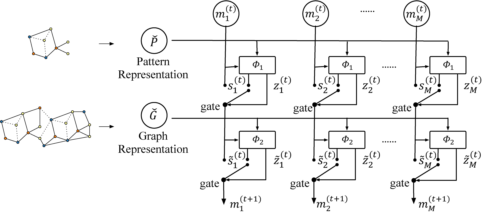

# NeuralSubgraphCounting

This repository is an official implementation of the paper [Neural Subgraph Isomorphism Counting](https://arxiv.org/abs/1912.11589).

## Introduction

We propose a learning framework which augments different representation learning architectures and iteratively attends pattern and target data graphs to memorize subgraph isomorphisms for the global counting.





We can use the **minimum code** (with the minimum lexicographic order) defined by Xifeng Yan to convert a graph to a sequence and use sequence models, e.g., CNN, LSTM, and Transformer-XL. A more direct apporach is to use graph covlutional networks to learn representations, e.g., RGCN, RGIN.

As for the interaction module, simple pooling is obviously not enough. We design the Memory Attention Predict Network (MemAttnPredictNet) and Dynamic Intermedium Attention Memory (DIAMNet), you can try them in the following reproduction part.



## Reproduction

### Package Dependencies

* tqdm
* numpy
* pandas
* scipy
* tensorboardX
* torch >= 1.3.0
* dgl >= 0.4.3


### Data Generation
The data in the KDD paper is available at [OneDrive](https://hkustconnect-my.sharepoint.com/:f:/g/personal/xliucr_connect_ust_hk/EqEONJuKHLVGo7ky759-ZvEB4WjWe2bKG2A725AGSD6G9g?e=HhIFeb).

You can also generate data by modifying `run.py` to set `CONFIG` and run 
```bash
cd generator
python run.py
```

For the *MUTAG* data, you can use the `mutag_convertor.py` to generate the raw graphs.
```bash
cd convertor
python mutag_convertor.py
```

You can use `generator\mutag_generator.py` to generate patterns. But be careful of duplications.

### Model Training/Finetuning

For the *small* dataset, just run
```bash
cd src
python train.py --model RGIN --predict_net SumPredictNet \
    --gpu_id 0 --batch_size 512 \
    --max_npv 8 --max_npe 8 --max_npvl 8 --max_npel 8 \
    --max_ngv 64 --max_nge 256 --max_ngvl 16 --max_ngel 16 \
    --pattern_dir ../data/small/patterns \
    --graph_dir ../data/small/graphs \
    --metadata_dir ../data/small/metadata \
    --save_data_dir ../data/small \
    --save_model_dir ../dumps/small/RGIN-SumPredictNet
```

```bash
cd src
python train.py --model RGIN --predict_net DIAMNet \
    --predict_net_mem_init mean --predict_net_mem_len 4 --predict_net_recurrent_steps 3 \
    --gpu_id 0 --batch_size 512 \
    --max_npv 8 --max_npe 8 --max_npvl 8 --max_npel 8 \
    --max_ngv 64 --max_nge 256 --max_ngvl 16 --max_ngel 16 \
    --pattern_dir ../data/small/patterns \
    --graph_dir ../data/small/graphs \
    --metadata_dir ../data/small/metadata \
    --save_data_dir ../data/small \
    --save_model_dir ../dumps/small/RGIN-DIAMNet
```

We find using the encoder module from RGIN-SumPredictNet results in the faster convergence of RGIN-DIAMNet

```bash
cd src
python finetune.py --model RGIN --predict_net DIAMNet \
    --predict_net_mem_init mean --predict_net_mem_len 4 --predict_net_recurrent_steps 3 \
    --gpu_id 0 --batch_size 512 \
    --max_npv 8 --max_npe 8 --max_npvl 8 --max_npel 8 \
    --max_ngv 64 --max_nge 256 --max_ngvl 16 --max_ngel 16 \
    --pattern_dir ../data/small/patterns \
    --graph_dir ../data/small/graphs \
    --metadata_dir ../data/small/metadata \
    --save_data_dir ../data/small \
    --save_model_dir ../dumps/small/RGIN-DIAMNet \
    --load_model_dir ../dumps/small/RGIN-SumPredictNet
```


For the *large* dataset, just run
```bash
cd src
python finetune.py --model RGIN --predict_net SumPredictNet \
    --gpu_id 0 --batch_size 128 --update_every 4 \
    --max_npv 16 --max_npe 16 --max_npvl 16 --max_npel 16 \
    --max_ngv 512 --max_nge 2048 --max_ngvl 64 --max_ngel 64 \
    --pattern_dir ../data/large/patterns \
    --graph_dir ../data/large/graphs \
    --metadata_dir ../data/large/metadata \
    --save_data_dir ../data/large \
    --save_model_dir ../dumps/large/RGIN-SumPredictNet \
    --load_model_dir ../dumps/small/RGIN-SumPredictNet
```

```bash
cd src
python finetune.py --model RGIN --predict_net DIAMNet \
    --predict_net_mem_init mean --predict_net_mem_len 4 --predict_net_recurrent_steps 3 \
    --gpu_id 0 --batch_size 128 --update_every 4 \
    --max_npv 16 --max_npe 16 --max_npvl 16 --max_npel 16 \
    --max_ngv 512 --max_nge 2048 --max_ngvl 64 --max_ngel 64 \
    --pattern_dir ../data/large/patterns \
    --graph_dir ../data/large/graphs \
    --metadata_dir ../data/large/metadata \
    --save_data_dir ../data/large \
    --save_model_dir ../dumps/large/RGIN-DIAMNet \
    --load_model_dir ../dumps/small/RGIN-DIAMNet
```


For the *MUTAG* dataset, you need to set the `train_ratio` manually
```bash
cd src
python train_mutag.py --model RGIN --predict_net SumPredictNet \
    --gpu_id 0 --batch_size 64 \
    --max_npv 4 --max_npe 3 --max_npvl 2 --max_npel 2 \
    --max_ngv 28 --max_nge 66 --max_ngvl 7 --max_ngel 4 \
    --pattern_dir ../data/MUTAG/patterns \
    --graph_dir ../data/MUTAG/raw \
    --metadata_dir ../data/MUTAG/metadata \
    --save_data_dir ../data/MUTAG/RGIN-SumPredictNet-0.4 \
    --save_model_dir ../dumps/MUTAG \
    --train_ratio 0.4
```

Transfer learning can improve the performance when the number of training data is limited.

```bash
cd src
python finetune_mutag.py --model RGIN --predict_net SumPredictNet \
    --gpu_id 0 --batch_size 64 \
    --max_npv 8 --max_npe 8 --max_npvl 8 --max_npel 8 \
    --max_ngv 64 --max_nge 256 --max_ngvl 16 --max_ngel 16 \
    --pattern_dir ../data/MUTAG/patterns \
    --graph_dir ../data/MUTAG/raw \
    --metadata_dir ../data/MUTAG/metadata \
    --save_data_dir ../data/MUTAG \
    --save_model_dir ../dumps/MUTAG/Transfer-RGIN-SumPredictNet-0.4 \
    --train_ratio 0.4 \
    --load_model_dir ../dumps/small/RGIN-SumPredictNet
```

For the RGIN-DIAMNet on the *MUTAG*, it is difficult to converge. So we load RGIN-SumPredictNet and replace the interaction module for both MeanMemAttnPredictNet and DIAMNet.

```bash
cd src
python finetune_mutag.py --model RGIN --predict_net DIAMNet \
    --predict_net_mem_init mean --predict_net_mem_len 4 --predict_net_recurrent_steps 1 \
    --gpu_id 0 --batch_size 64 \
    --max_npv 4 --max_npe 3 --max_npvl 2 --max_npel 2 \
    --max_ngv 28 --max_nge 66 --max_ngvl 7 --max_ngel 4 \
    --pattern_dir ../data/MUTAG/patterns \
    --graph_dir ../data/MUTAG/raw \
    --metadata_dir ../data/MUTAG/metadata \
    --save_data_dir ../data/MUTAG \
    --save_model_dir ../dumps/MUTAG/RGIN-DIAMNet-0.4 \
    --train_ratio 0.4 \
    --load_model_dir ../dumps/MUTAG/RGIN-SumPredictNet-0.4
```

```bash
cd src
python finetune_mutag.py --model RGIN --predict_net DIAMNet \
    --predict_net_mem_init mean --predict_net_mem_len 4 --predict_net_recurrent_steps 1 \
    --gpu_id 0 --batch_size 64 \
    --max_npv 8 --max_npe 8 --max_npvl 8 --max_npel 8 \
    --max_ngv 64 --max_nge 256 --max_ngvl 16 --max_ngel 16 \
    --pattern_dir ../data/MUTAG/patterns \
    --graph_dir ../data/MUTAG/raw \
    --metadata_dir ../data/MUTAG/metadata \
    --save_data_dir ../data/MUTAG \
    --save_model_dir ../dumps/MUTAG/Transfer-RGIN-SumPredictNet-0.4 \
    --train_ratio 0.4 \
    --load_model_dir ../dumps/MUTAG/Transfer-RGIN-DIAMNet-0.4
```

### Model Evaluation
```bash
cd src
python evaluate.py ../dumps/small/RGIN-DIAMNet
```

### Citation

The details of this pipeline are described in the following paper. If you use this code in your work, please kindly cite it.

```bibtex
@inproceedings{liu2020neuralsubgrpahcounting,
  author    = {Xin Liu, Haojie Pan, Mutian He, Yangqiu Song, Xin Jiang, Lifeng Shang},
  title     = {Neural Subgraph Isomorphism Counting},
  booktitle = {ACM SIGKDD Conference on Knowledge Discovery and Data Mining {KDD} 2020, August 23-27, 2020, San Diego, United States.}
}
```

### Miscellaneous

Please send any questions about the code and/or the algorithm to <xliucr@cse.ust.hk>.